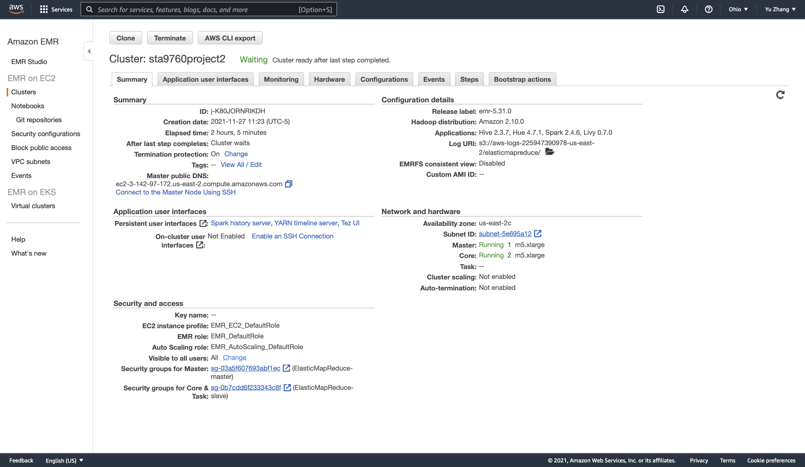

# Analyzing 10Gb of Yelp Reviews Data
We will analyze a subset of Yelp's business, reviews and user data. This dataset comes to us from [Kaggle](https://www.kaggle.com/yelp-dataset/yelp-dataset) although we have taken steps to pull this data into a publis s3 bucket: `s3://sta9760-yelpdataset/yelp-light/*business.json`

## [Analysis](https://github.com/yuzhang09/yelp-dataset-analysis/blob/4058ef1f95b3e4f020c9407a4fba5e4c71f8f1b3/Analysis.ipynb)

There are four parts in total. 

### Parts I - Installation and Initial Setup
1. Installed and imported the require packages which are `pandas` and `matplotlib`. 
2. Uploaded datasets into a s3 bucket called "sta9760f2021-datasets" and used spark to load the data from s3 into a dataframe. In the beginning, I loaded the  "yelp_academic_dataset_business" dataset first.
3. Overviewed data by displaying the number of rows and columns in the datasets, printing the dataframe schema, and displaying the first 5 rows with "business_id", "name", "city", "state", "stars" and "categories" columns.

### Parts II - Analyzing Categories
1. Answered the question "how many unique categories are represented in this dataset?" by analyzing the dataframe. 
2. First of all, broke out these categories from the business_id by using `split` function since there are multiple categories list for one business, and they all show at the same columns
3. Used `distinct` and `count` function to get the total number of unique categories available. Next, used `groupby` function that group the categories and count the number of each categoreis, and show the top 20 categories. 
4. Finally, used `matplotlib` to draw a bar chart to dispay the top 20 categories. 

### Parts III - Further Analysis 
Answered two questions: Do Yelp Reviews Skew Negative? and Which top 5 states have highest average star rating in Health & Medical category than others?
1. By answering the first question Do Yelp Reviews Skew Negative?", loaded the "yelp_academic_dataset_review" dataset, and used `groupby` function to group the "business_id" and got the average stars for each business. Then, joined review and business dataframes together by "business_id", and used `withcolumn` function to create a new column called "k" to caculate the skew between the avg stars accumulated from written reviews and the actual star rating of a business. The formula I used is "(bus_review['avg(stars)'] - bus_review['stars']) / bus_review['stars']". Finally, used a historgram show the distribution of the skew. Based on the graph, most of the skew are closed to 0, however, it is slightly postive skew, which mean people who have postive feedback are more likely to leave high star rating. Reviewers who left a written response were more satisfied than normal.
2. The second question "Which top 5 states have highest average star rating in Health & Medical category than others?". First, joined the review and busienss dataframe, and used `split` function to get individual categories for every business, and picked category of Health & Medical by using `filter` function. Next, used `groupby` function to group the state, and calculated the average stars of every state, and got the top 5 states that have the highest star rating in Health & Medical category, and displayed it in a bar chart. Based on the graph, DC is the state that has the highest star rating in Health & Medical category, CA is the second, the rest of states are OR, TX, and CO in order.

### Parts IV - Should the Elite be Trusted?
1. The last part is about answering the question "Should the Elite be Trusted?". First of all, loaded the "yelp_academic_dataset_user" data, and did some data cleaning by reaname the "average_stars" to "user_stars" by using `withColumnRenamed` function, and created a new dataframe "df_user_elite" that used `filter` function to select the elite users only, which are the users with not empty "elite" columns. 
2. Second, created a dataframe "elite_review" by joining the "yelp_academic_dataset_review" and "df_user_elit" to by "user_id" column. The purpose is to find the reviews that gave by elite users only to those business. 
3. Third, joined the "elite_review" and "yelp_academic_dataset_business" by "business_id" column to find the  actual business rating vs rating to the business that gave by elite users. And then, created "k" column to calculate the difference between actual business rating vs rating to the business that gave by elite users by using formula "(elite_review_bus['user_bus_stars'] - elite_review_bus['bus_act_stars]) / elite_review_bus['bus_act_stars])", and created a histogram to show the distribution of the skew. Based on the graph, most of the k are closed to 0 and distributed between 0 and 1, and it is negative skew, which means most of elite usesrs would give the similar or a little bit higher rating than the actual rating for the business. And there are some outliers shows that some elite users would give much higher rating than the actual business rating.

## Cluster and Notebook Configs

